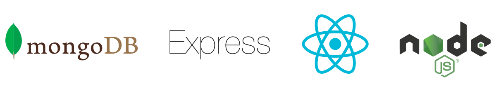
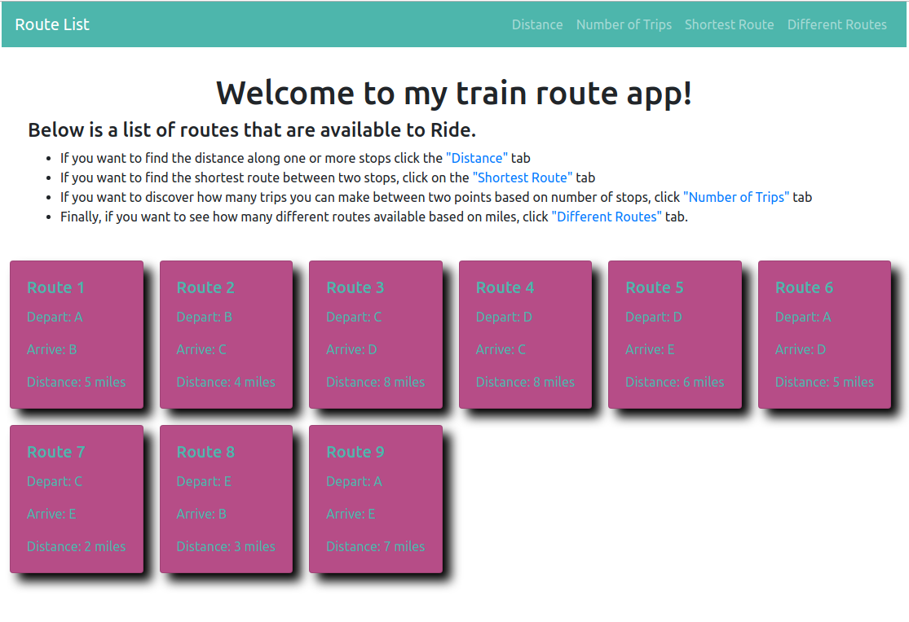

This app is to use algorithms to access a database and get various data. I wrote the algorithms first and tested them, then wrote the server and database, then wrote the React components.
I am using mLab to hold the mongodb to minimize set up efforts.

### To get it locally on your machine from the terminal:

1. Clone repo to a folder of your choice:
  `git clone git@github.com:AlexVotry/train-spotting.git`

2. Go to project:
  `cd train-spotting`

3. Install packages
  `npm install`

4. Move into client folder:
  `cd client`

5. install react packages:
  `npm install`

6. Move back to root folder:
  `cd ..`

7. Add a **dev.js** file to the *config* folder (you will find it in the rooot folder).

8. I will share my file info on google drive. Copy and paste into **dev.js**

9. To run program (from the root folder *train-spotting*):
  `npm run dev`

  This will start up server and client react and open a window in your browser (localhost:3000).

